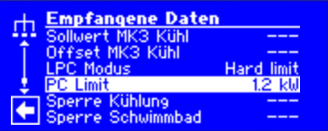
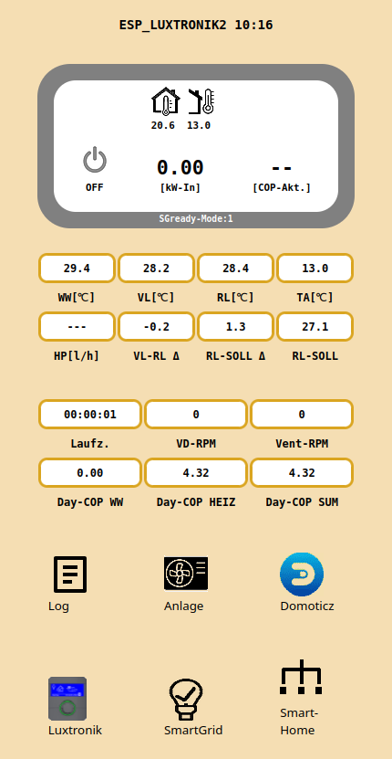

 
 # Luxtronik Smart-Home-Interface (Modbus-TCP)

## ACHTUNG Info für alle die eine Kommunikation mit der Luxtronik über Websocket nutzen:

In der neuen Firmware-Version V3.91.0 ist der Websocket-Antwort-String von XML auf JSON umgestellt worden. Die Umstellung auf JSON ist ja erst mal zu begrüßen, aber leider müssen alle Programme die Websocket nutzen jetzt erst mal angepasst werden (gut wenn man das selber anpacken kann ;-)...alle Programme die die binäre Schnittstelle ("Java-Interface") Nutzen sind nicht betroffen...auch die Modbus-Kommunikation (SHI) funktioniert noch ohne Probleme
...diese Anpassung ist noch *nicht* umgesetzt.

 > (because this is related to a german version of the "Luxtronik" Heatpump Controller, the following description is in german, please use a translate function to get english or other translations, but there is no problem to communicate any issues and questions in english)

Ab  Software-Version V3.90.3 gibt es die neue Funktion "Smart-Home-Interface" (SHI) in der Luxtronik Wärmepumpen Steuerung. 

Dies ermöglicht Werte der Steuerung über MODBUS-TCP zu lesen und schreiben. Dieses Interface ist zusätzlich zu den beiden bestehenden IP basierenden Interfaces "Websocket-Client" und "TCP-Client" (auch 'Java-Interface gennant) vorhanden, muss jedoch in der Steuerung aktiviert werden. 

Das Interface ist beschränkt auf Werte für die Leistungsbegrenzung nach Par. 14a EnWG als auch zur internen Leistungsoptimierung über ein Smart-Grid-Gateway. Natürlich kann man auch eine bestehende Home-Automation Software (HomeAssistant, Domoticz, ....) einbinden. Oder - wie ich es realisiert habe - ein eigenes Programm für einen ESP32-Microcontroller schreiben und damit einen eigenen "Smart-Grid-Controller" bauen [ESP32_Luxtronik2](https://github.com/raibisch/ESP32_Luxtronik2/blob/main/readme.md).

Von AIT wird ein solches Modul auch angeboten [AIT-SolarManager](https://www.novelan.com/download/18.2db41e671932967a1fc141/1731581284379/AIT_Anleitung_SolarManager.pdf)
...leider gibt es aber keine offizielle Doku der Schnittstelle. 

## Aktivierung in Luxtronik

> Für die nachfolgenden Infos sind grundlegende Kenntnisse über das MODBUS-Protokoll notwendig !! Alle Infos sind ohne Gewähr und auf eigene Gefahr anzuwenden.

**Anmerkung: es wird keine zusätzliche "GLT"-Lizenz benötigt (eine parallele Nutzung ist aber möglich). Es muss lediglich die Funktion im "Kundendienst-Modus" aktiviert werden.**

## Modbus-TCP aktiv schalten:

SERVICE --> Systemsteuerung --> Konnektivität --> Smart-Home-Interface

Werte anzeigen:

Wenn SHI aktiviert ist *und* innerhalb von 10min Daten gelesen oder geschrieben wurden erscheint ein kleines Netzwerk-Icon auf dem Startbildschirm. Bei aktivierter Leistungsreduzierung "PC-Setpoint" ist auch das Leistungsbegrenzungs-Icon links deneben sichtbar.

## Liste der mir bekannten Modbusregister (Holding-Register und Input-Register)

[Modbus-Register](Modbusregister.md)

> Die für eine dauerhafte Aktivierung der eingestellten Werte müssen die Register nicht ständig neu beschrieben werden, es reicht die Register (oder Inputs) innerhalb des Time-Outs von 10min zu lesen (z.B. alle 2sec).

## Test der Modbus-Register

mit verschiedenen Windows oder Linux Bordmitteln lassen sich die Daten schon mal probeweise lesen und schreiben:

Kommandozeilen-Programme: 'modpoll' oder 'mbpoll' 
> Hinweis: es gibt verschiedene Zählweisen für die Modbus-Register "0" oder "1" basierend (mbpoll ist in der Voreinstellung zum Beispiel "1" basierend, dann muss zu den Werten der Liste jeweils noch "+1" zu den Register addiert werden)

### Beispiele:

#### Holding-Register: Lesen des Heizungs-Setpoints:

``
mbpoll -r 10002 -c 1 192.168.2.101
``

#### Input-Register lesen der Betriebsart:

``mbpoll -r 10001 -t 3 -c 1  192.168.2.101``

...oder für Mutige auch mal schreiben:

#### Holding-Register: Schreiben  des Heizungs-Setpoints:

``mbpoll -r 10002 192.168.2.101 320``

# Eigene Programme für den ESP32 Microcontroller

## ESP32 lib 'LuxModbusSHI'
im Ordner 'examples' ist ein minimales Beispiel mit Ausgabe der Modbus-Daten über die serielle Schnittstelle des ESP32.

[LuxModbusSHI](https://github.com/raibisch/mylibs/blob/main/LuxModbusSHI/examples/src/mininal/main.cpp)

## ESP32 lib 'ESP32_Luxtronik2'
'All-In-One' Web-App für Luxtronik:

[ESP32_Luxtronik2](https://github.com/raibisch/ESP32_Luxtronik2/blob/main/readme.md)

## Quelle meiner Infos 

[Haustechnikdialog Luxtronik SHI-Interface](https://www.haustechnikdialog.de/Forum/t/284442/Eigene-Regelung-PV-Luxtronik-2-1-Smart-Home-Interface-SHI)

[Haustechnikdialog Luxtronik Firmware](https://www.haustechnikdialog.de/Forum/t/272274/Alpha-Innotec-Firmware?page=25)

Hier wird auch über Details der einzelnen Werte diskutiert und weitere Erkenntnisse geteilt. Man muss oft ein wenig in den Themenseiten blättern...findet dort aber sehr gute Infos. 
(Vielen Dank an alle aktiven Teilnehmer des Forums)

 
 

