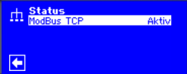
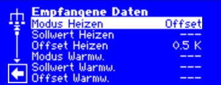

 
 # Luxtronik Smart-Home-Interface (Modbus-TCP)

 (because this is related to a german version of the "Luxtronik" Heatpump Controller, the following description is in german, please use a translate function to get english or other translations, but there is no problem to communicate any issues and questions in english)

Ab  Software-Version V3.90.3 gibt es die neue Funktion "Smart-Home-Interface" (SHI) in der Luxtronik Wärmepumpen Steuerung. 

Dies ermöglicht Werte der Steuerung über MODBUS-TCP zu lesen und schreiben. Dieses Interface ist zusätzlich zu den beiden bestehenden IP basierenden Interfaces "Websocket-Client" und "TCP-Client" (auch 'Java-Interface gennant) vorhanden, muss jedoch in der Steuerung aktiviert werden. 

Das Interface ist beschränkt auf Werte für die Leistungsbegrenzung nach Par. 14a EnWG als auch zur internen Leistungsoptimierung über ein Smart-Grid-Gateway. Natürlich kann man auch eine bestehende Home-Automation Software (HomeAssistant, Domoticz, ....) einbinden. Oder - ich ich es realisiert habe - ein eigenes Programm-Modul für einen ESP32-Microcontroler schreiben und damit einen eigenen "Smart-Grid-Controller" bauen.

Von AIT wird ein solches Modul auch angeboten [AIT-SolarManager](https://www.novelan.com/download/18.2db41e671932967a1fc141/1731581284379/AIT_Anleitung_SolarManager.pdf)
...leider gibt es aber keine offizielle Doku der Schnittstelle. 

## ESP32 lib 'LuxModbusSHI'

[LuxModbusSHI](../LuxModbusSHI)

## Aktivierung

> Für die nachfolgenden Infos sind grundlegende Kenntnisse über das MODBUS-Protokoll notwendig !! Alle Infos sind ohne Gewähr und auf eigene Gefahr anzuwenden.

> Anmerkung: es wird keine zusätzliceh "GLT"-Lizenz benötig (eine parallele Nutzung ist aber möglich). Es muss lediglich die Funktion im "Kundendienst-Modus" aktiviert werden.

SERVICE --> Systemsteuerung --> Konnektivität --> Smart-Home-Interface

Modbus-TCP aktiv schalten:

Werte anzeigen:

Wenn SHI aktiviert ist *und* innerhalb von 10min Daten gelesen oder geschrieben wurden erscheint ein kleines Netzwerk-Icon auf dem Startbildschirm

## Modbus-Register

mit verschiedenen Windows oder Linux Bordmitteln lassen sich die Daten schon mal probeweise lesen und schreiben:

Kommandozeilen-Programme: 'modpoll' oder 'mbpoll' 

### Beispiele:

#### Holding-Register: Lesen des Heizungs-Setpoints:

``
mbpoll -r 10002 -c 1 192.168.2.101
``

#### Input-Register lesen der Betriebsart:

``mbpoll -r 10002 -t 3 -c 1  192.168.2.101``

...oder für Mutige auch mal schreiben:

#### Holding-Register: Schreiben  des Heizungs-Setpoints:

``mbpoll -r 10002 192.168.2.101 320``

## Liste der mir bekannten Modbusregister (Holding-Register und Input-Register)

Hinweis: es gibt verschiedene Zählweisen für die Modbus-Register "0" oder "1" basierend (mbpoll ist in der Voreinstellung zum Beispiel "1" basierend, dann muss zu den Werten der Liste jeweils noch "+1" zu den Register addiert werden).

[Modbus-Register](Modbusregister.md)

## Quelle meiner Infos 

[Haustechnikdialog Luxtronik SHI-Interface](https://www.haustechnikdialog.de/Forum/t/284442/Eigene-Regelung-PV-Luxtronik-2-1-Smart-Home-Interface-SHI)

[Haustechnikdialog Luxtronik Firmware](https://www.haustechnikdialog.de/Forum/t/272274/Alpha-Innotec-Firmware?page=25)

Hier wird auch über Details der einzelnen Werte diskutiert und weitere Erkenntnisse geteilt. Man muss oft ein wenig in den Themenseiten blättern...findet dort aber sehr gute Infos. 
(Vielen Dank an alle aktiven Teilnehmer des Forums)

 
 

